## Guia d'Ús Tècnica 

### [Bitwarden](https://bitwarden.com/)

### 1. Instal·lació i Configuració Inicial: Descàrrega, instal·lació i creació de la BBDD principal o compte mestre.
 
#### 1.1. Descàrrega i Instal·lació

- Accedeix a la web oficial: [Bitwarden](https://bitwarden.com/download) 

- Selecciona la versió segons el sistema operatiu.

- Fes clic a “Download” i obre el fitxer d’instal·lació.

- Segueix l’assistent fins a completar la instal·lació.

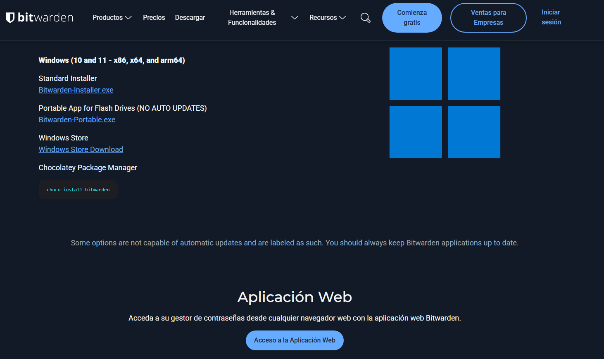
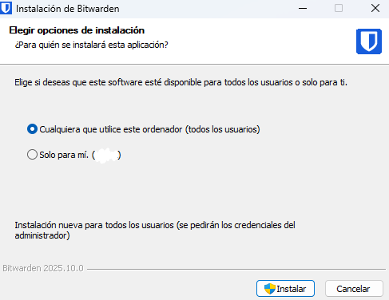 

#### 1.2. Creació del Compte Mestre

- Obre Bitwarden.

- Fes clic a “Create Account”.

- Introdueix:
  - Email corporatiu
  - Contrasenya mestra (ha de ser llarga i segura)
  - Pista o “Hint” per recordar-la (opcional)

- Fes clic a “Submit” per crear el compte.

- Inicia sessió amb les teves noves credencials.

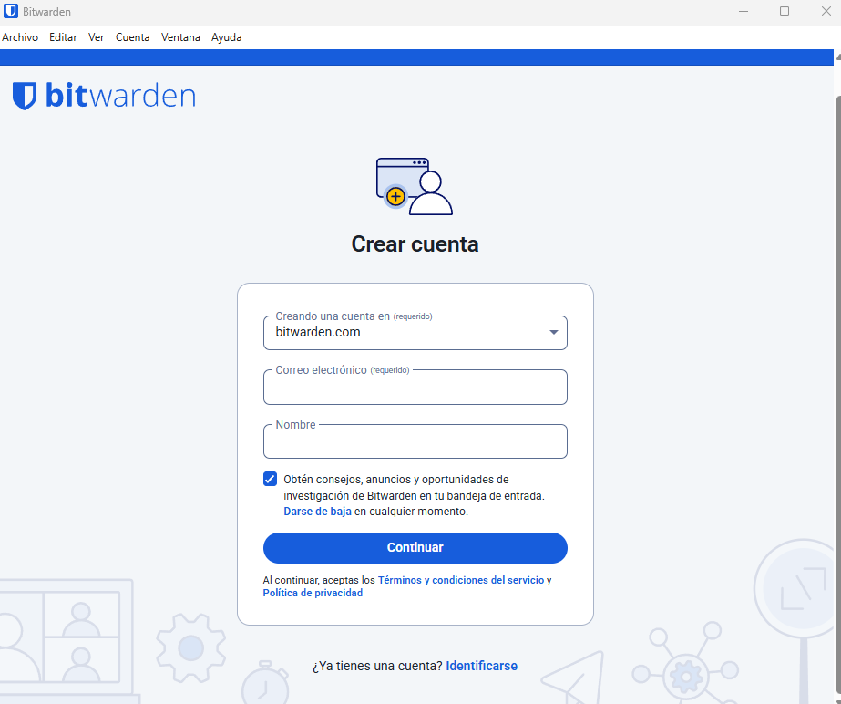
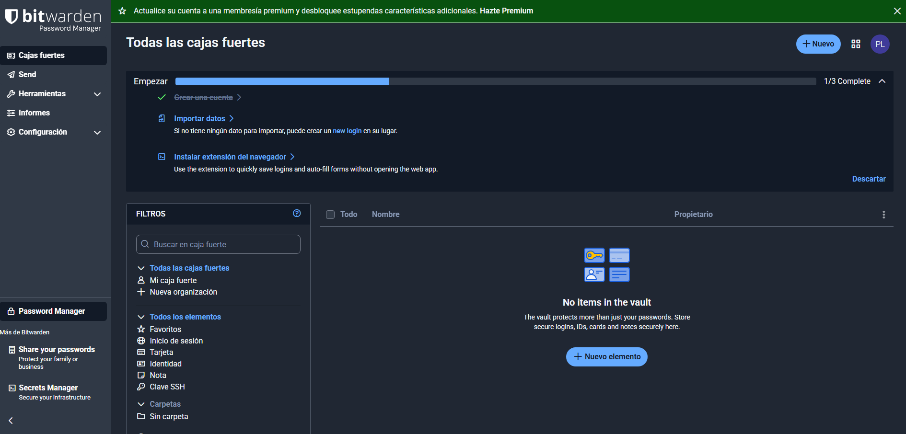

---
   
### 2. Generació de Contrasenyes Segures: Explicació de com utilitzar el generador de contrasenyes de l'eina (paràmetres, longitud, caràcters especials).

#### 2.1. Accedir al Generador

- Fes clic a “+ Add Item” o obre el panell lateral.

- Selecciona l’opció “Password Generator”.

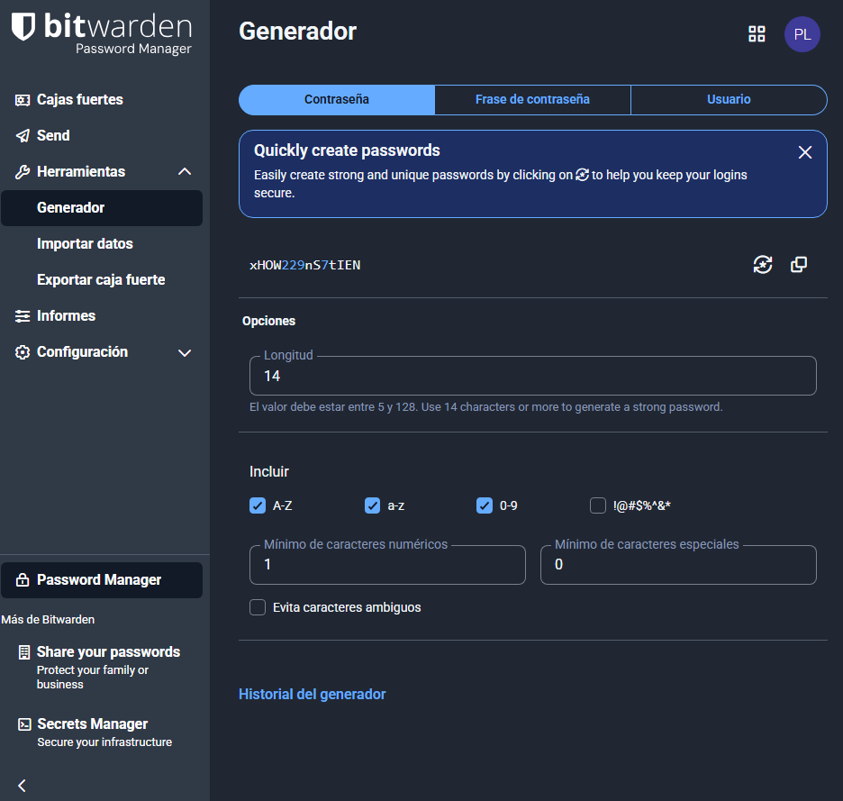

#### 2.2. Configuració dels Paràmetres

- Longitud: recomanat entre 12 i 20 caràcters.

- Caràcters especials: actiu (més seguretat).

- Majúscules i números: actius per defecte.

- Evitar caràcters similars (0/O, l/I): opcional.

Quan estigui configurat, prem “Copy” per copiar la contrasenya segura i enganxar-la on vulguis.

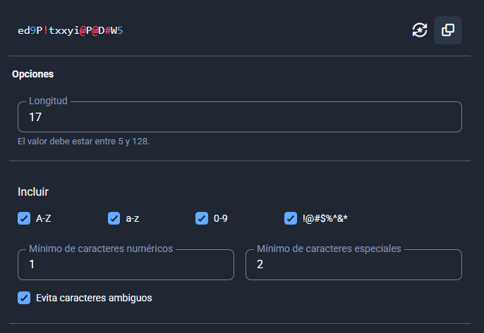

---
   
### 3. Exemples d'Ús i Emplenament Automàtic:
     
#### 3.1. Desar una Credencial de Correu Electrònic

- Al tauler principal, selecciona “+ Add Item”.

- Omple els camps:
  - Nom: Gmail corporatiu
  - Usuari: exemple@empresa.cat
  - Contrasenya: (enganxa la generada)
  - URL: https://mail.google.com

Desa amb “Save”.

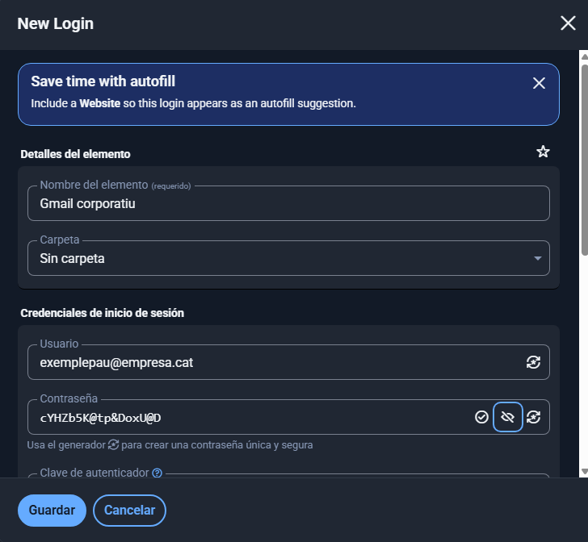

#### 3.2. Desar una Credencial d’una Aplicació o Servei Web
 
- Repeteix els passos anteriors.

- Exemples: Microsoft Teams, Canva, GitHub, etc.

- Afegeix el camp “Notes” per indicar informació addicional (per ex., departament o data d’actualització).

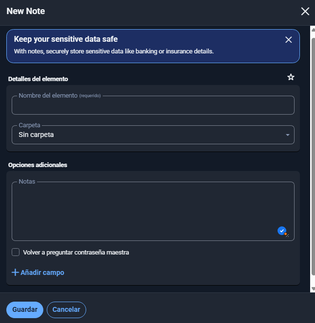

#### 3.3. Ús de l’Extensió del Navegador

- Instal·la l’extensió des de la [Chrome Web Store](https://bitwarden.com/download/#browser)

- Inicia sessió amb el compte Bitwarden.

- Quan accedeixis a un web amb credencials guardades, apareixerà un icona de clau en el camp d’usuari.

- Fes clic per emplenar automàticament usuari i contrasenya.

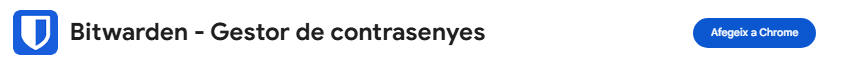

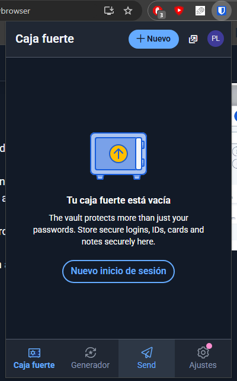

---
   
### 4. Gestió de Còpies de Seguretat (Backup):

#### 4.1. Exportació de les Dades

- A l’app d’escriptori o web, ves a Settings → Tools → Export Vault.

- Tria el format .json o .csv.

- Introdueix la contrasenya mestra per confirmar.

- Desa l’arxiu de còpia de seguretat.

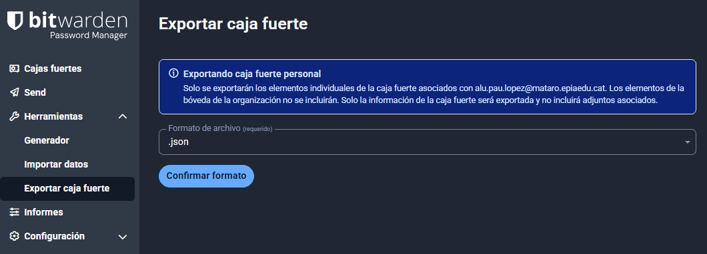

#### 4.2. Bones Pràctiques d’Emmagatzematge

Opció recomanada:
- Desa la còpia en una clau USB xifrada.

Alternativa:
- Desa-la en un núvol segur amb xifratge.

Mai guardis la còpia de seguretat sense xifrar al mateix dispositiu on tens Bitwarden instal·lat.

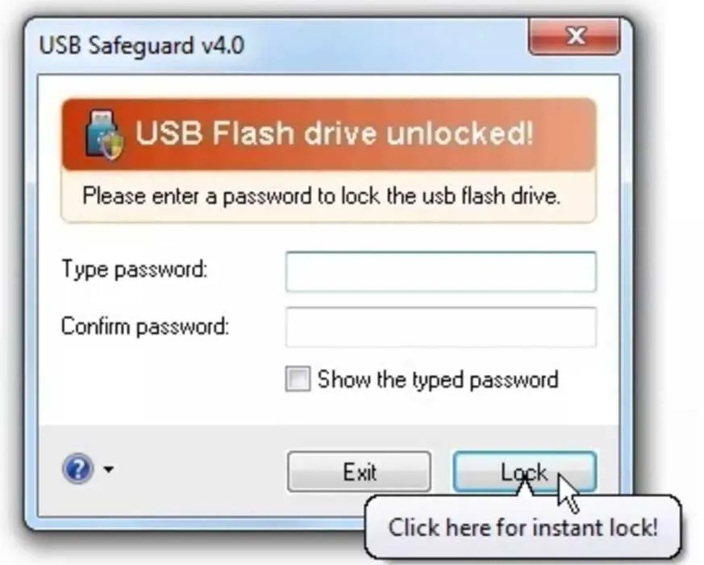

