## GESTIÓ FLEXIBLE DE DISCOS (LVM amb Zorin OS)

### 1. Introducció:

#

### 2. Índex:
   1. Introducció:	
   2. Índex:	
   3. Configuracions Prèvies:	

#

### 3. Configuracions Prèvies:
Primer de tot haurem de crear una màquina virtual, hi posarem 2 CPUs i 8GB (ja que es una interfície gràfica) i afegirem 3 discs durs més de 10GB, un cop posat els requeriments de la màquina, la iniciem per procedir amb la instal·lació del OS b.

| Disc | Ús | Mida Recomanada |
| ----- | ----- | :---: |
| /dev/sda | Disc principal | **20 GB** |
| /dev/sdb | Primer disc per a LVM | **10 GB** |
| /dev/sdc | Per mirroring | **10 GB** |
| /dev/sdd | Per snapshots o expansió | **10 GB** |

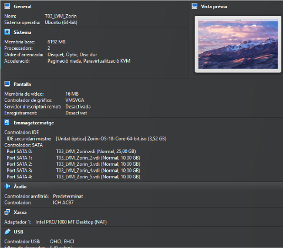

#

### 4. Detecció de discos:
Un cop hàgiu instal·lat tot el os, obrirem la terminal i introduirem la comanda ‘fdisk -l’ per comprovar que el sistema ha detectat els discos com a particions.

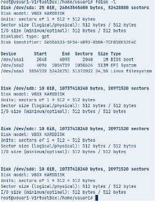

#

### 5. Inicialització de discos:
Ara crearem els volums físics amb la comanda: ‘pvcreate’ a partir de les particions de la part anterior (sdb/sdc/sdd).

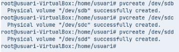

Recordatori: Recomano que abans de començar a posar totes les comandes, recomano posar la comanda sudo su, per realitzar totes les comandes amb root així tots els processos seran més ràpids a la hora de realizarlos

#

### 6. Inicialització de discos:
Seguidament crearem el grup de volums, mitjançant la comanda: ‘vgcreate volgrup’ posteriorment hi podem agregar o eliminar volums. En el meu cas la comanda completa serà: ‘vgcreate volgrup /dev/sdb /dev/sdc /dev/sdd’

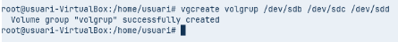

I si en algun cas volem afegir algún nou volum en el grup, només haurem d'introduir la comanda: ‘vgextend volgrup nom_disc’

Finalment per veure característiques sobre el grup de volum creat anteriorment ho farem amb la comanda: ‘vgdisplay’ veurem info com el nom del grup, el estat, el format, les àrees que abarca i moltes coses més que les podeu veure en la imatge.

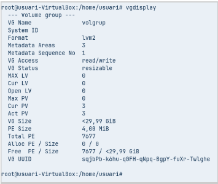

#

### 7. Crear volums lògics:
Es creen a partir dels grups de volums indicant la mida, el grup de volum i el nom que se li vol donar al volum lògic, és fa amb la comanda: ‘lvcreate’

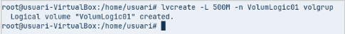

I ara amb la comanda: ‘vgdisplay’ s’observa com l’espai està siguent utilitzat.
Recordo que els volums lògics són com les particions, per tant, per utilitzar-se caldrà formatar-los amb un sistema d’arxius.

1- I ara per muntar un volum lògic parcialment, caldrà utilitzar la comanda ‘mount’ per muntar el volum cap la carpeta creada en l’anterior pas

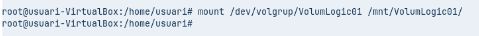
PD: Aquesta acció caldria fer-la cada cop al iniciar la máquina.

2- I si volem que el volum logic estigui muntat de forma permanent, cal editar l’arxiu ‘/etc/fstab’

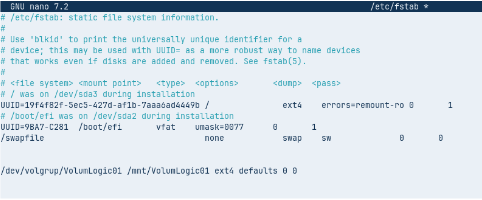

Copiarem la última línea del codi on podeu veure que he agregat una línia de codi. I si volem modificar la mida d’un lv usarem: lvextend (per estendre el volum) i lvreduce (per reduir la mida). I recordo que abans de modificar un lv sempre s’ha de desmuntar perquè no estigui en ús: umount /mnt/lv01

Si en algun cas volem ampliar el volum lògic, la mida s’indica amb el paràmetre -L:
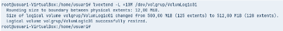
I per ampliar el sistema de fitxers per poder aprofitar la mida extra que anteriorment hem afegit, ho farem amb: ‘resize2fs’

# 

I si en canvi de ampliar, volem reduir, ho fariem amb les següents comandes: ‘umount /mnt/VolumLogic01’ / ‘e2fsck -f /dev/volgrup/VolumLogic01’ / ‘resize2fs /dev/volgrup/VolumLogic01 100M’ / ‘lvreduce -L 100M /dev/volgrup/VolumLogic01’

I si volem fer algun tipus de comprovació per veure que els canvis s’han desat correctament, podrem fer servir comandes com: ‘pvs’ / ‘vgs’ / ‘lvs’

PVS: Mostra els volums físics creats indicant si estan assignats algun grup de volums.

VGS: Serveix per veure els grups de volums existents i indicant els nombre de volums físics que el formen, els LV definits, l’espai total i l’espai sense assignar.

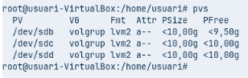

VGS: Mostra els LV definits amb les seves propietats.
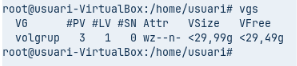

Si en algun cas volem eliminar un volum lògic, només caldria fer dos passos:

Desmuntar el volum lògic
Executar comanda lvremove

Per desmuntar el volum lògic, com us he dit abans, seria amb la comanda: ‘umount /mnt/VolumLogic01’ . Finalment per eliminar un cop desmontat el volum lògic: ‘lvremove /dev/volgrup/VolumLogic01’

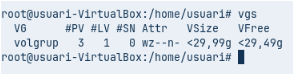

Seguidament passarem amb les ‘snapshots’, són una còpia exacte d’un LV que conté totes les dades en el moment que es crea la instantània. És molt útil perquè permet fer les còpies de la informació sense parar els serveis:

Es realitza la snapshot
Es fa còpia de seguretat sense haver de parar el server.

Per posar-ho en pràctica, crearem una instantània, amb una mida i nom, a part també li indicarem que es una snapshot i que es el que farà.

comanda: ‘lvcreate -L 100M -s -n copiaVolumLogic01 /dev/volgrup/VolumLogic01’

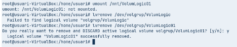

I per veure els dos lv creats i com la còpia apunta al volum original com us he indicat abans, ho realitzarem amb  la comanda: ‘lvs volgrup’

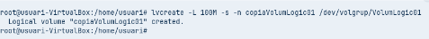

Un cop haguim vist que la còpia esta creada i ubicada correctament, muntarem la còpia per veure el contingut.

seguident, creem un grup de volums amb dos dels volums físics, amb la comanda introduïda amb passos anteriors: ‘vgcreate vg_mirror /dev/sdc /dev/sdd’

En el meu cas he tingut que treure’l del grup actual, netejar la informació de el lvm del disc, reinicializarlo com a pv nou i finalment crear el nou grup amb el nom de: vg_mirror com diu la tasca

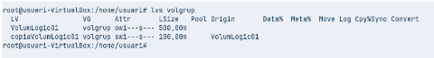

Seguidament crearem el sistema del mirror simple amb la comanda anteriorment feta en altres passos: ‘lvcreate -L 90M -m1 -n mirrorlv vg_mirror’ Aqui estem dien que crearem un nou vl, de 90MiB, amb el nom de: mirrorlv.

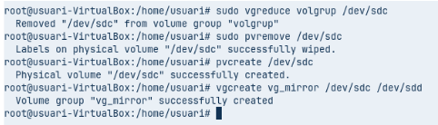

Finalment podrem observar com el volum lògic està format pels miralls introduïts en el pas anterior i dels logs, que serveixen per mantenir la sincronització:

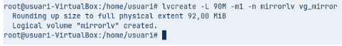

Podem identificar gràcies a la comanda: ‘lva -a -o +devices’ el nombre de miralls que es vulguin mantenir amb el paràmetre -m a lvcreate.
