## T04: Serveis de directori - LDAP

### **1\. Objecte de l'Encàrrec**

L'objecte del present Plec és la instal·lació, configuració i validació d'un servei **OpenLDAP** en un entorn virtualitzat basat en Ubuntu Server. Aquest servei s'ha de configurar per actuar com a directori centralitzat d'usuaris i grups per al domini de proves **innovatechXX.test**.

---

### **2\. Requeriments d'Infraestructura Inicial**

El consultor ha de verificar la correcta configuració de la infraestructura virtual abans d'iniciar la implementació:

**R.INF.01 \-** Configuració de la màquina Server (Server Hostname).

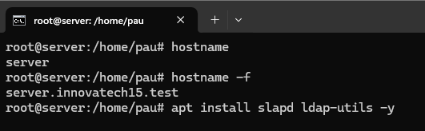

**R.INF.02 \-** Interfície de Xarxa Pública.

**R.INF.03 \-** Interfície de Xarxa Privada.

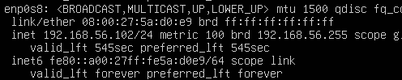

---

### **3\. Tasques d'Implementació i Configuració del Servidor LDAP**

La Consultora EverPia ha de complir estrictament amb les següents tasques d'instal·lació i configuració:

#### **3.1. Instal·lació i Configuració Base d'OpenLDAP**

**T.LDAP.01 \-** Instal·lació del servei OpenLDAP.

**T.LDAP.02 \-** Configuració de la base de dades.

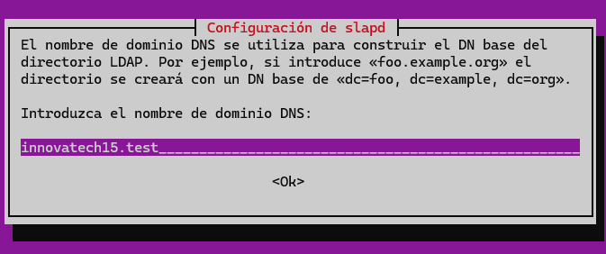

**T.LDAP.03 \-** Configuració de la contrasenya d'administrador.

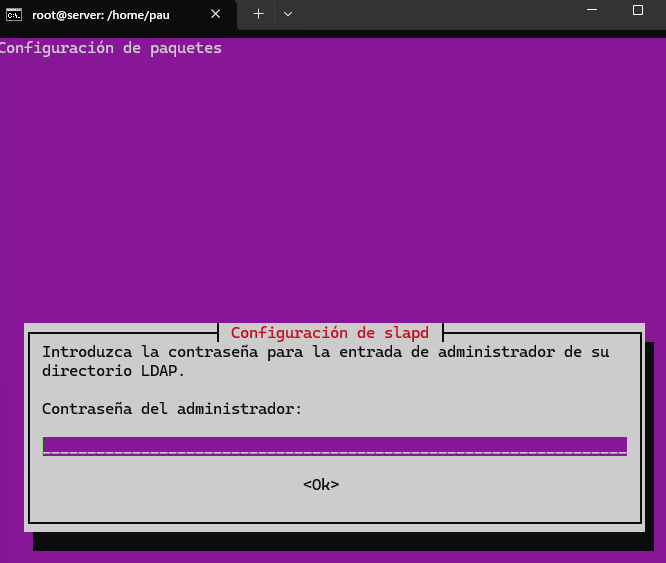

**T.LDAP.04 \-** Creació d'Unitats Organitzatives (OU) inicials.

**T.LDAP.05 \-** Validació de les Unitats Organitzatives.

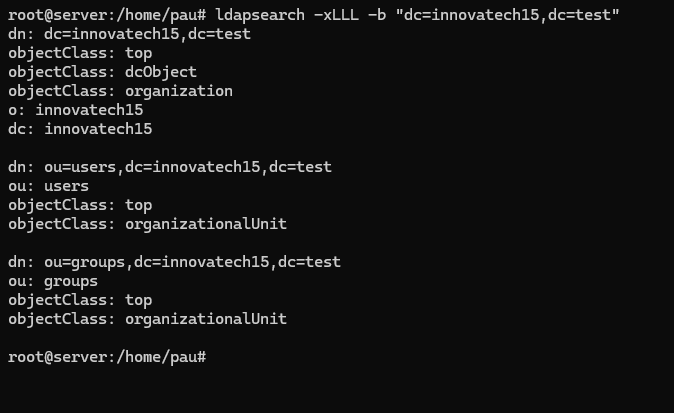

#### **3.2. Gestió i Administració (LAM)**

**T.LAM.01 \-** Instal·lació del Gestor d'Usuaris LDAP (LAM).

**T.LAM.02 \-** Accés Remot i Configuració.

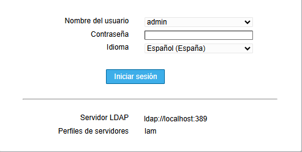

**T.LAM.03 \-** Configuració per defecte.

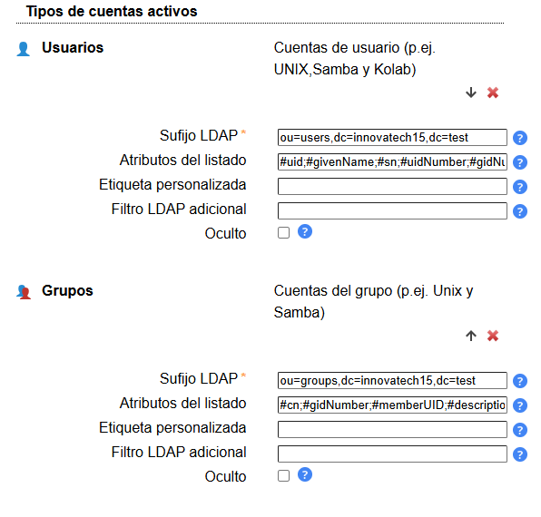

**T.LAM.04 \-** Creació de Grups.

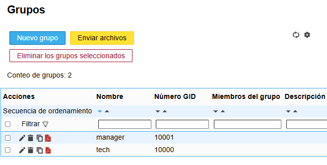

**T.LAM.05 \-** Creació d'Usuaris de Prova.

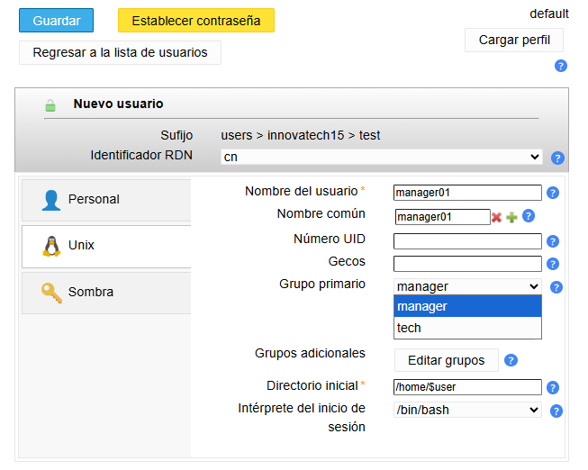

---

### **4\. Integració de Client (Client Ubuntu Desktop)**

**T.CLI.01 \-** Instal·lació del Client.

**T.CLI.02 \-** Resolució de Noms.

**T.CLI.03** \- Validació de la Connectivitat LDAP. 

**T.CLI.04 \-** Mòduls d'Autenticació.

**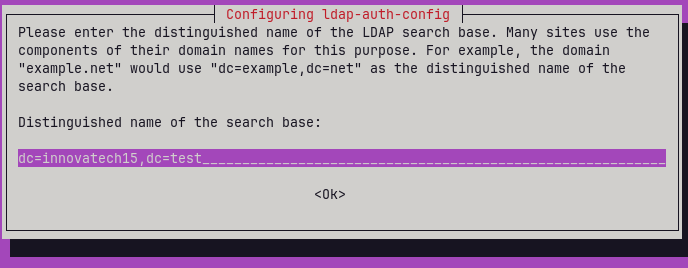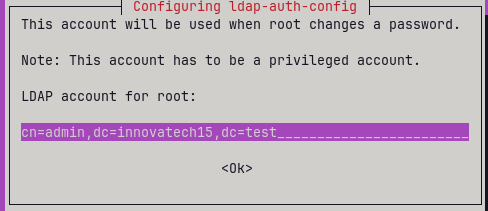]**

**T.CLI.05 \-** Configuració del Client.

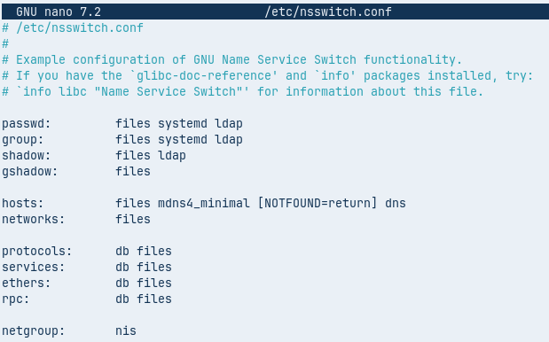

**T.CLI.06 \-** Comprovació del Sistema.

**T.CLI.07 \-** Prova d'Accés Final.

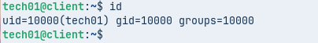

