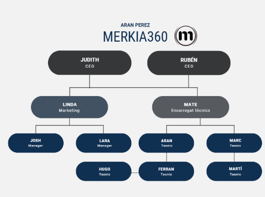

# **Anàlisi de l’entorn**

## **MERKIA360**

## **FET PER: ARAN PEREZ I PAU LÓPEZ**

### **Index:** 

**Fase 1: Organigrama**

[**Fase 2: Analitzar l’entorn real de l’empresa. Microentorn i Macroentorn**]

[**Fase 3: Definir els canvis de l'entorn de l'empresa**]

[**Fase 4: Del món VUCA al món BANI**]

[**Fase 5: Fer el CANVAS del model de negoci del vostre client per a definir com l’empresa crea i capta valor i l’ofereix als seus clients**]

[**Fase 6: Descripció de la tipologia i patró del negoci**]
[**Fase 7: Aplicar la intel·ligència artificial al disseny del model de negoci**]

[**Fase 8: DAFO per comprovar la viabilitat potencial del client. Planificació de l’estratègia de futur**]

[**Fase 9: L’empresa com a sistema. Àrees funcionals de l’empresa. Funcionament de l’empresa. L’estructura organitzativa de l’empresa.**]

[**Fase 10: La cultura empresarial i la imatge corporativa.**]

[**Fase 11: Missió, visió i valors de l’empresa.**]

[**Fase 12: Accions concretes i RSC. Balanç social.**]

---

# **Fase 1: Organigrama**

# **Fase 2: Analitzar l’entorn real de l’empresa. Microentorn i Macroentorn** {#fase-2:-analitzar-l’entorn-real-de-l’empresa.-microentorn-i-macroentorn}

## **MACROENTORN:**

**Econòmics:** El nivell d’activitat està lligat a la situació econòmica. Per exemple, durant les crisis, la reutilització tendeix a augmentar, mentre que en períodes de creixement, el reciclatge pren més protagonisme

**Socioculturals:** La població cada cop és més conscient de l'importància de la sostenibilitat i del que aporta el reciclatge.

**Polítics i legals:** Les lleis europees i catalanes afavoreixen l’economia circular i regulen la gestió de residus.

**Tecnològics:** Els ràpids avenços obliguen les empreses a adaptar-se a nous dispositius i materials.

**Mediambientals:** L’interès per reduir residus i combatre el canvi climàtic impulsa el sector.

**Internacionals:** Les tendències globals i els preus de les matèries primeres poden tenir un impacte tant positiu com negatiu.

   

## **MICROENTORNS:**

**Competència:** Merkia al se una empresa que recondisiona dispositius electrònics per després vendre'ls, té varies empresas de competència.

Per exemple; Media markt, ja que media markt vent dispositius electrònics tant nous com recondicionats es una gran part de la competència, pensant en la venta a particulars.

I una gran competencia de venta de dispositius a empreses sería, Borax Aliban, una empresa de gran nivell a barcelona que es dedica al mateix. Link: [Media Markt](http://google.com/search?q=media+mark&oq=media+mark&gs_lcrp=EgZjaHJvbWUyBggAEEUYOTIMCAEQABgKGMkDGIAEMhUIAhAuGAoYrwEYxwEYkgMYgAQYjgUyDQgDEAAYkgMYgAQYigUyBwgEEAAYgAQyEAgFEC4YrwEYxwEYgAQYjgUyEAgGEC4YrwEYxwEYgAQYjgUyEAgHEC4YrwEYxwEYgAQYjgUyEAgIEC4YrwEYxwEYgAQYjgUyEggJEC4YChivARjHARiABBiOBdIBCDE4NzlqMGo0qAIAsAIB&sourceid=chrome&ie=UTF-8&safe=active&ssui=on&zx=1761227709755&no_sw_cr=1) Link: [Borax Aliban](https://www.borax.es/?srsltid=AfmBOop81YY91UJURpHHhtz_ukdEH030i92W3M_sgGwlSN5pnwgj5s8n)

**Productes substitutius:** Els productes substitutius de merkia serian els mòbils, ordinadors… més nous, per exemple ara mateix si al iphone 17 baixes al preu 500 euros, doncs aquest podria ser un producte substitutiu.

# **Fase 3: Definir els canvis de l'entorn de l'empresa** {#fase-3:-definir-els-canvis-de-l'entorn-de-l'empresa}

## **Canvis en el Macroentorn:** 

**Competència:** Ha passat de ser un sector marginal a un mercat en auge. Abans eren petits botiguers; ara competeix contra gigants globals com Backmarket i una proliferació de nous competidors en línia. La competència ja no és només per preu, sinó per confiança (garanties) i imatge de marca.

**Clients:** El client ha canviat la seva mentalitat. Abans veia la tecnologia de segona mà com una opció de baixa qualitat. Ara, motivat per l'estalvi, la consciència ecològica i la millora de la qualitat del reacondicionat, la veu com una opció viable i responsable.

**Proveïdors:** La font de productes (equipament de segona mà a l'engròs) és cada cop més valuosa i disputada. Apareixen nous tipus de proveïdors, com empreses que renoven els seus parcs informàtics periòdicament i busquen socios de reciclatge responsables.

## 

## **Canvis en el Macroentorn:**

Econòmics: La inflació i la crisi econòmica fan que els consumidors i empreses busquin opcions més assequibles, beneficiant el mercat del reacondicionat.

Socials/Ecològics: Hi ha una demanda social creixent per la sostenibilitat. La "economia circular" ha deixat de ser un concepte de niu per a convertir-se en un valor de mercat. Merkia 360 es beneficia d'aquest canvi cultural.

Legals: La legislació sobre Residus d'Aparalls Elèctrics i Electrònics (RAEE) és cada cop més estricta. Això representa un cost addicional, però també una oportunitat per a Merkia 360, ja que el seu model de reciclatge integral els posiciona com a cumplidors i experts.

## 

## 

## 

# **Fase 4: Del món VUCA al món BANI** {#fase-4:-del-món-vuca-al-món-bani}

## **Anàlisi des de la perspectiva VUCA:**

**Volatilitat:** Els preus dels components i la disponibilitat de productes de segona mà fluctuen ràpidament.

**Incertesa:** És difícil predir les tendències de consum en l'ecommerce o les noves polítiques de les plataformes com Wallapop.

**Complexitat:** La seva cadena de subministrament és complexa: compra, revisió, venda, reciclatge... tot amb múltiples interrelacions.

**Ambiguïtat:** Una mateixa acció pot tenir resultats contradictoris. Una campanya de màrqueting ecològic pot atreure clients, però també pot generar preguntes incòmodes sobre el "greenwashing" si no es gestiona amb transparència.

## 

## **Anàlisi des de la perspectiva BANI (més actual i adequada):**

**Fràgil:** El seu model depèn críticament de les plataformes digitals (Wallapop, Backmarket). Un canvi en el seu algorisme o polítiques podria trencar el seu flux principal de vendes de la nit al dia.

**Ansiós:** Hi ha una ansietat constant sobre la qualitat dels lots que compren (no saben si trobaran més o menys dispositius reparables), la satisfacció del client (que no puguin revisar un defecte) i la competència dels preus.

**No lineal:** Un vídeo viral sobre un bon o mal producte seu pot causar un èxit o una crisi desproporcionada i imprevisible. Els resultats no són lineals amb l'esforç.

**Incomprensible:** La velocitat a la que canvien les tecnologies, les normatives mediambientals i els comportaments dels consumidors pot fer que sigui gairebé impossible comprendre totes les forces que afecten el negoci alhora.

# 

# 

# **Fase 5: Fer el CANVAS del model de negoci del vostre client per a definir com l’empresa crea i capta valor i l’ofereix als seus clients** {#fase-5:-fer-el-canvas-del-model-de-negoci-del-vostre-client-per-a-definir-com-l’empresa-crea-i-capta-valor-i-l’ofereix-als-seus-clients}

![][image2]

# 

# 

# 

# 

# **Fase 6: Descripció de la tipologia i patró del negoci** {#fase-6:-descripció-de-la-tipologia-i-patró-del-negoci}

**Tipologia del Negoci:** És una empresa del sector terciari o de serveis, específicament dins del comerç minorista i majorista tecnològic, amb un fort component de logística inversa i serveis de valor afegit (reparació i reciclatge).

**Patró del Negoci (Com crea valor):** El seu patró es basa en la Economia Circular. El seu cicle és:

1. Adquirir: Compren allò que altres consideren "residu" o "excedent" a baix cost.  
   2. Revaloritzar: Apliquen coneixement (reparació) per transformar aquest "residu" en un producte valuable de nou.  
   3. Vendre: Comercialitzen aquest producte revaloritzat en un mercat que el demanda.  
   4. Reciclar: Del que no es pot revaloritzar, en treuen el màxim valor possible gestionant-ne el reciclatge correctament, tancant el cicle i generant un impacte social positiu.

# 

# 

# 

# 

# 

# 

# 

# 

# 

# 

# **Fase 7: Aplicar la intel·ligència artificial al disseny del model de negoci** {#fase-7:-aplicar-la-intel·ligència-artificial-al-disseny-del-model-de-negoci}

Creiem que a merkia es podria implantar la IA de les següents maneres:

**Optimització de l'Oferta de Valor (Qualitat i Confiança):**

- Avantguarda en Reacondicionament: Implementar un sistema de visió per computadora que analitzi fotos dels dispositius rebuts per detectar automàticament esquerdes, ratlles o danys físics, classificant-los per prioritat de reparació.  
- Testeig Intel·ligent: Software amb IA que executi tests de estrès en ordinadors i components, aprenent dels patrons de fallada per identificar problemes futurs amb més precisió que un test estàndard.

**Revolucionar les Activitats Clau (Eficiència):**

- Triatge i Logística Inteligent: Una IA pot analitzar el lot comprat i, basant-se en l'estat, la demanda del mercat i el cost de les peces de recanvi, predir amb altaprohabilitat quins dispositius són rentables reparar i quins s'han de desballestar per reciclar. Això optimitza el temps dels tècnics.

**Potenciar les Fonts d'Ingressos i la Relació amb Clients:**

- Precificació Dinàmica i Predictiva: Una eina d'IA que analitzi en temps real els preus de milers de productes similars a Wallapop, Backmarket i eBay, considerant factors com l'estat, l'època de l'any i la demanda, per suggerir el preu de venda òptim que maximitzi la velocitat de venda i el benefici.  
- Atenció al Client 24/7: Un chatbot amb IA (com ChatGPT integrat) a la seva pròpia web o xarxes socials per respondre preguntes freqüents sobre garanties, temps de lliurament o compatibilitat d'accessoris, alliberant temps per a les consultes més complexes.

# **Fase 8: DAFO per comprovar la viabilitat potencial del client. Planificació de l’estratègia de futur** {#fase-8:-dafo-per-comprovar-la-viabilitat-potencial-del-client.-planificació-de-l’estratègia-de-futur}

![][image3]

# **Fase 9: L’empresa com a sistema. Àrees funcionals de l’empresa. Funcionament de l’empresa. L’estructura organitzativa de l’empresa.** {#fase-9:-l’empresa-com-a-sistema.-àrees-funcionals-de-l’empresa.-funcionament-de-l’empresa.-l’estructura-organitzativa-de-l’empresa.}

## **Àrees Funcionals de l’Empresa:**

### **Àrea Tècnica i Operativa**

* # Funció: Cor del negoci

* # Responsabilitats:

* # Recepció i classificació de dispositius

  * # Diagnòstic tècnic i reparació

  * # Control de qualitat i testeig

  * # Gestió del reciclatge

  * # Manteniment del taller

### **Àrea Comercial i de Màrqueting**

* # Funció: Connexió amb el mercat

* # Responsabilitats:

  * # Gestió de plataformes online (Wallapop, Backmarket)

  * # Atenció al client i postvenda

  * # Estratègia de preus i ofertes

  * # Comunicació digital i xarxes socials

### **Àrea d’Aprovisionament i Logística**

* # Funció: Cicle de materials

* # Responsabilitats:

  * # Relació amb proveïdors d'equipament

  * # Gestió d'inventaris

  * # Coordinació d'enviaments

  * # Relació amb gestors de residus

### **Àrea Administrativa i Financera**

* # Funció: Sostenibilitat econòmica

* # Responsabilitats:

  * # Control de costos i pressupostos

  * # Facturació i cobraments

  * # Gestió de garanties

  * # Anàlisi de rendibilitat

# 

## **Estructura Organitzativa:**

# 

# **DIRECCIÓ/GERÈNCIA**

#     **│**

#     **├── ÀREA TÈCNICA (Cap de Taller)**

#     **│   ├── Tècnics en reparació**

#     **│   └── Responsable de qualitat**

#     **│**

#     **├── ÀREA COMERCIAL (Responsable Comercial)**

#     **│   ├── Gestor de plataformes online**

#     **│   └── Atenció al client**

#     **│**

#     **├── APROVISIONAMENT I LOGÍSTICA**

#     **│   ├── Comprador/Selector**

#     **│   └── Coordinador logístic**

#     **│**

#     **└── ADMINISTRACIÓ I FINANCES**

#         **├── Administratiu**

#         **└── Responsable de comptabilitat**

# 

# 

# 

# 

# 

# **Fase 10: La cultura empresarial i la imatge corporativa.**  {#fase-10:-la-cultura-empresarial-i-la-imatge-corporativa.}

## **Cultura Empresarial de Merkia 360**

* Cultura Tècnica i Pràctica: Enfocada en la resolució de problemes i l'eficiència operativa  
* Cultura Col·laborativa: Treball en equip entre les àrees tècnica i comercial  
* Cultura d’Aprenentatge Continu: Constant actualització en tecnologies i tècniques de reparació  
* Cultura de Sostenibilitat: Compromís ambiental com a eix central

## **Valors Culturals**

* Transparència: Comunicació clara sobre l'estat dels productes  
* Responsabilitat: Compromís amb la qualitat i el medi ambient  
* Innovació: Cerca constant de millores en processos  
* Integritat: Honestedat en les condicions dels productes

# 

# 

# 

# 

# 

# 

# 

# 

# **Fase 11: Missió, visió i valors de l’empresa.** {#fase-11:-missió,-visió-i-valors-de-l’empresa.}

## **Missió:**

"Oferir tecnologia accessible i fiable mitjançant el reacondicionament professional d'equips, allargant-ne la vida útil i promovent la sostenibilitat a través del reciclatge responsable, contribuint així a una economia circular veritable."

## **Visió:**

"Ser referència en el sector de la tecnologia sostenible a nivell local, reconeguts per la nostra qualitat tècnica, compromís ambiental i capacitat per fer la tecnologia accessible a tothom, impulsant un canvi cap a un consum tecnològic més responsable."

## **Valors Corporatius:**

**Sostenibilitat Ambiental | Qualitat Tècnica | Transparència | Innovació Contínua | Accessibilitat**

# 

# 

# 

# 

# 

# 

# 

# **Fase 12: Accions concretes i RSC. Balanç social.** {#fase-12:-accions-concretes-i-rsc.-balanç-social.}

## **Accions de RSC (Responsabilitat Social Corporativa)**

### **Medi Ambient (Pilar Ecològic)**

* Reciclatge Certificat: 100% dels components no reparables es reciclen amb gestors autoritzats  
* Reducció de Residus: Evitar que dispositius electrònics acabin en abocadors  
* Eficiència Energètica: Ús de llums LED i equipament eficient al taller  
* Logística Sostenible: Optimització de rutes per a reduir emissions

### **Social (Pilar Social)**

* Accessibilitat Digital: Oferir equips assequibles per a col·lectius vulnerables  
* Formació i Ocupació: Contractació de joves tècnics i programes d'aprenentatge  
* Transparència Informatica: Informació clara sobre l'origen i estat dels productes  
* Suport a Comunitat Local: Col·laboració amb escoles i entitats locals

### **Bon Govern (Pilar Econòmic)**

* Pràctiques Comercials Ètiques: Preus justos i condicions clares  
* Relació Responsible amb Proveïdors: Pagaments puntuals i condicions equitatives  
* Qualitat i Garantia: Compliment rigorós de les garanties ofertes  
* Innovació Contínua: Inversió en millora de processos i formació

## 

## 

## 

## **Balanç Social 2024 (Projecció)**

### **Impacte Quantificable**

* Dispositius Reacondicionats: 1.200 unitats/any  
* Residus Electrònics Reciclats: 3.5 tones/any  
* Emissions de CO2 Estalviades: 18 tones/any (vs. producció nova)  
* Clients Atesos: 900 clients/any (85% B2C, 15% B2B)

### **Indicadors Socials**

* Ocupació: 6 persones (4 tècniques, 2 comercials/administratius)  
* Formació Interna: 120 hores/any en formació tècnica  
* Satisfacció Client: 95% de valoracions positives en plataformes  
* Accés a Tecnologia: 35% de productes venuts a pressuposts inferiors a 200€

### **Compromisos Futurs**

* Proper Any: Implementar sistema de qualitat ISO 9001  
* Mitjà Termini: Obtenir certificació de gestió ambiental  
* Llarg Termini: Convertir-se en centre de referència per a formació en reparació i economia circular

# **GRÀCIES PER L'ATENCIÓ**

