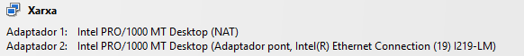
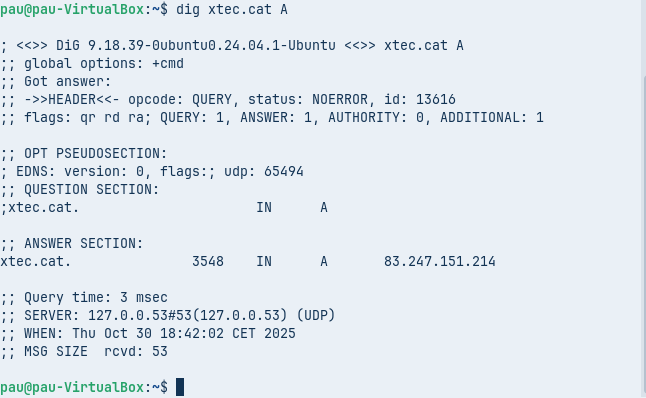
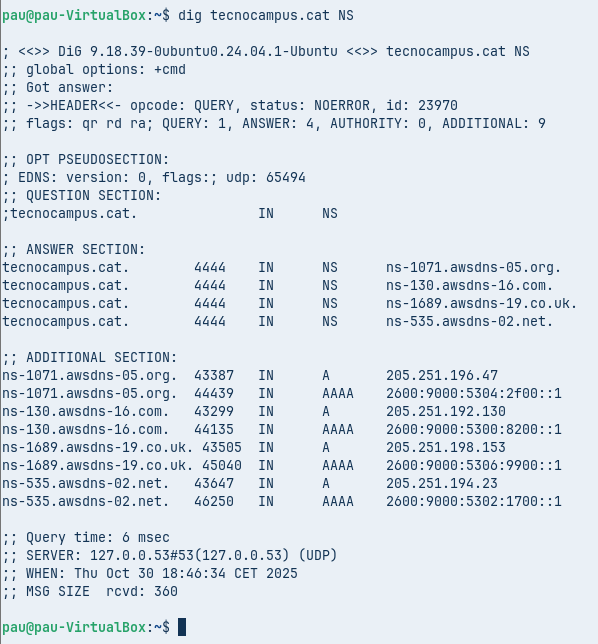
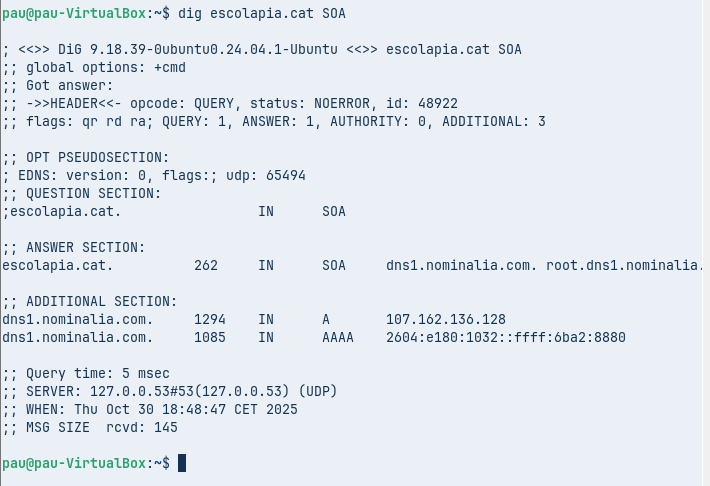
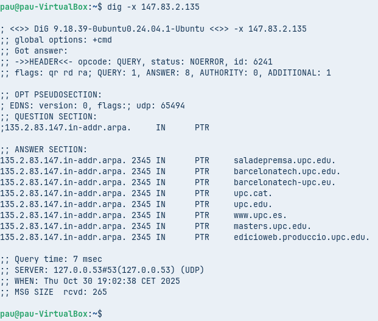
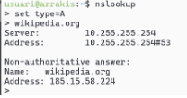
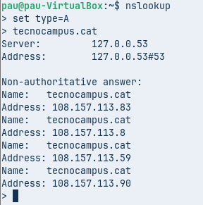
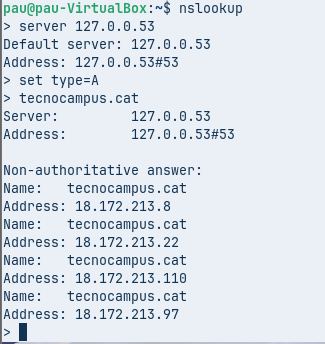
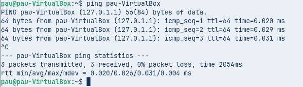

## T06: Fonaments del servei DNS

### Fase teòrica: Fase Pràctica: Diagnosi de Noms (Auditoria amb CLI)
Heu de demostrar l'ús de les principals utilitats de diagnosi DNS en els diferents sistemes operatius que utilitza el client (Linux/macOS i Windows).

Per a cada eina, executeu les comandes indicades a continuació contra el domini que s’indiqui explícitament i captureu/analitzeu els resultats.

Per fer aquest demostració, caldrà usar un equip Zorin amb dues interfícies, la primera en NAT i la segona en adaptador pont amb la IP correctament configurada segons indicacions dels vostres responsables.

---

### A. Diagnosi Avançada amb dig (Linux / macOS)
- Comanda 1: Consulta Bàsica de Registre A
  - Executa dig xtec.cat A
    

- Anàlisi: Identifica la IP de resposta, el valor TTL i el servidor que ha respost a la consulta.
  - **IP de resposta (A record associat a xtec.cat):**
    83.247.151.214
  - **TTL indicat al camp “ANSWER SECTION”:**
    3548 segons
  - **Servidor que ha respost (veure “SERVER:” al final de la sortida):**
    127.0.0.53#53 (UDP) — servidor local (systemd-resolved)

---

- Comanda 2: Consulta de Servidors de Noms (NS)
  - Executa dig tecnocampus.cat NS

- Anàlisi: Quins són els servidors de noms autoritatius per a aquest domini?
  - ns-1071.awsdns-05.org.
  - ns-130.awsdns-16.com.
  - ns-1689.awsdns-19.co.uk.
  - ns-535.awsdns-02.net.

---

- Comanda 3: Consulta Detallada SOA
  - Executa dig escolapia.cat SOA
    

- Anàlisi: Quina és la informació del correu de l'administrador i el número de sèrie del domini?
  - Correu de l'administrador: root@dns1.nominalia.com
  - Número de sèrie del domini: 1761028965

---

- Comanda 4: Consulta resolució inversa
  - Executa comanda dig -x 147.83.2.135
    

- Anàlisi: Quina informació sobre els registres s’obté?

  - saladepremsa.upc.edu
  - barcelonatech.upc.edu
  - barcelonetech-upc.eu
  - upc.cat
  - upc.edu
  - www.upc.es
  - masters.upc.edu
  - edicioweb.produccio.upc.edu

---

### **Comprovació de Resolució amb nslookup (Multiplataforma)**
L’eina nslookup es troba a pràcticament a qualsevol sistema operatiu. Es pot usar de forma similar a dig incloent l’argument o si s’executa nslookup sense arguments, entrar en el mode interactiu, us apareix un prompt (>). Serà aquest mode el que explorareu . 

El mode és força senzill, bàsicament hi ha tres comandes a usar:
- set type= per indicar el tipus de consulta: A, AAA, MX, NS, SOA, TXT o ALL.
- server IP on IP és la IP del servidor de noms al que es vol fer la consulta, també es pot indicar el nom del servidor enlloc de la IP, per exemple, server a9-66.akam.net.
- exit que serveix per sortir de la comanda.

---

- Comanda 1: Consulta Bàsica no Autoritativa
  - Seleccionar type=A i com a domini de consulta tecnocampus.cat
    

- Anàlisi: Per què indica que la resposta és no autoritativa?
Perquè la resposta no ve directament del servidor que gestiona el domini tecnocampus.cat, sinó d’un altre servidor que només ha guardat la informació o l’ha buscat abans. En resum: no és la font principal, sinó una còpia de la informació.

---

- Comanda 2: Consultes autoritatives
  - Escriure server IP i escriure la IP del primer servidor de noms del domini tecnocampus.cat que s’ha obtingut
    d’una consulta anterior. A continuació, indiqueu que voleu consultar registres de tipus A i del domini
    tecnocampus.cat
  

- Anàlisi: Quines diferències s’observen a la resposta obtinguda amb la comanda 1?
Abans sortien unes IPs i ara en surten unes altres. Això passa perquè la web utilitza diversos servidors i el DNS et pot donar una IP diferent cada vegada.

---

### Resolucions locals
Finalment es vol comprovar el funcionament de la resolució local, útil per entorns de xarxa local on no es disposa de servidor de noms propi i que evita haver d’accedir a equips o recursos per la seva IP.

En fer ping pau-VirtualBox, l’ordinador ha trobat el nom dins del fitxer local /etc/hosts i no ha fet servir DNS. Això confirma que la resolució local funciona.
